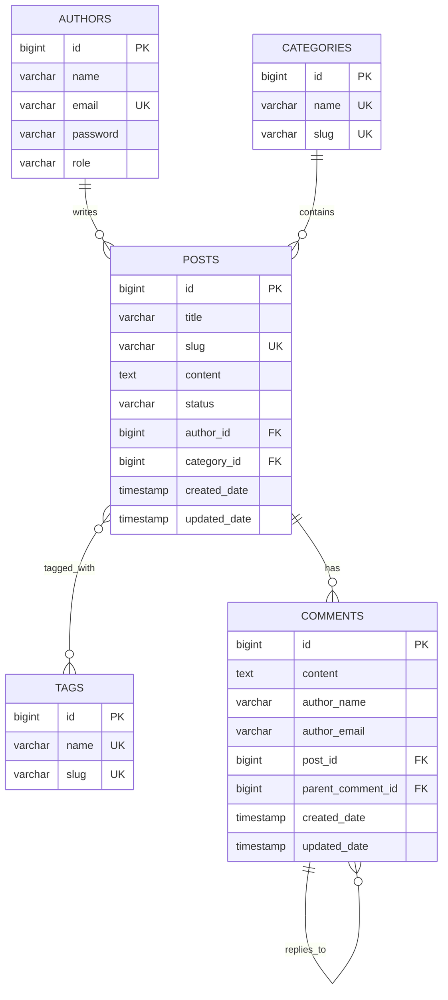

# 📝 BlogVerse API

A production-ready RESTful blogging platform API built with **Spring Boot 4**. BlogVerse powers modern content-driven applications with secure authentication, flexible role-based access control, and a thoughtfully designed comment system that works for both registered users and anonymous readers.

Whether you're building a personal blog, a multi-author publication, or a content platform — BlogVerse gives you a solid, extensible backend out of the box.

---

## ✨ Why BlogVerse?

Most blogging APIs force you to choose: either lock everything behind auth, or leave it wide open. BlogVerse does neither — it gives you **granular control** with sensible defaults.

### 🎯 Key Features

- **🔐 JWT Authentication** — Stateless, token-based auth with Spring Security. Register, login, and access protected resources with Bearer tokens. No sessions, no cookies — just clean, scalable auth.

- **👥 Role-Based Access Control** — Three distinct roles (`ADMIN`, `AUTHOR`, `READER`) with clearly defined permissions. Admins moderate everything. Authors own their content. Readers engage freely.

- **💬 Smart Comment System** — Anonymous readers can comment without creating an account and get an `editToken` to manage their own comments. Logged-in users skip the token entirely — the system checks ownership or admin privileges automatically. Two auth flows, one clean API.

- **🧵 Nested Replies** — Comments support threaded replies, so authors and admins can engage directly with reader feedback. Replies are linked to parent comments and returned in a nested structure.

- **📂 Content Organization** — Posts are organized with **categories** (one per post) and **tags** (many per post). Both use URL-friendly slugs for clean, SEO-friendly endpoints.

- **🗄️ Flyway Migrations** — Database schema is version-controlled with Flyway. No manual SQL, no Hibernate auto-DDL surprises. Every schema change is tracked, repeatable, and safe for production.

- **📊 Health & Monitoring** — Spring Boot Actuator exposes `/health`, `/info`, and `/metrics` endpoints for monitoring and operational visibility.

- **⚡ Production-Ready Defaults** — HikariCP connection pooling, `open-in-view: false` to prevent lazy-loading bugs, `ddl-auto: validate` to ensure schema integrity, and environment-based profile configuration (`dev` / `prod`).

### 🏗️ Architecture at a Glance

```
┌──────────────┐     ┌──────────────┐     ┌──────────────┐     ┌──────────────┐
│   Client     │────▶│  Controller  │────▶│   Service    │────▶│  Repository  │
│  (REST API)  │     │   (DTOs)     │     │  (Business)  │     │   (JPA)      │
└──────────────┘     └──────────────┘     └──────────────┘     └──────────────┘
       │                    │                                         │
       │              ┌─────┴─────┐                            ┌─────┴─────┐
       │              │ Security  │                            │ PostgreSQL│
       │              │ (JWT +    │                            │ + Flyway  │
       └──────────────│  Roles)   │                            └───────────┘
                      └───────────┘
```

- **Controllers** handle HTTP requests and map to/from DTOs (Java records)
- **Services** contain all business logic — authorization, validation, entity mapping
- **Repositories** are Spring Data JPA interfaces with zero boilerplate
- **Security** layer intercepts every request, validates JWTs, and injects `UserDetails`

---

## 🛠️ Tech Stack

| Layer | Technology |
|-------|-----------|
| **Framework** | Spring Boot 4.0.6 |
| **Language** | Java 17 |
| **Database** | PostgreSQL |
| **ORM** | Spring Data JPA / Hibernate |
| **Migrations** | Flyway |
| **Auth** | Spring Security + JWT (jjwt 0.12.3) |
| **Build** | Maven |
| **Utilities** | Lombok |
| **Monitoring** | Spring Boot Actuator |

---

## 📁 Project Structure

```
src/main/java/com/blogverse/api/
├── config/              # SecurityConfig (JWT filter chain, endpoint rules)
├── controller/          # REST controllers (Auth, Post, Comment, Category, Tag)
├── domain/
│   ├── entity/          # JPA entities (Author, Post, Comment, Category, Tag)
│   └── enums/           # Role (ADMIN, AUTHOR, READER), PostStatus
├── dto/
│   ├── request/         # Incoming request DTOs (records)
│   └── response/        # Outgoing response DTOs (records)
├── exception/           # GlobalExceptionHandler, custom exceptions
├── mapper/              # Entity ↔ DTO mappers
├── repository/          # Spring Data JPA repositories
├── security/            # JwtService, JwtAuthFilter, CustomUserDetailsService
├── service/             # Service interfaces
│   └── impl/            # Service implementations
└── util/                # SlugUtils
```

```
src/main/resources/
├── application.yaml         # Main config (DB, JPA, Flyway, JWT, Actuator)
├── application-dev.yaml     # Dev profile overrides
└── db/migration/
    ├── V1__init_schema.sql          # Authors, posts, categories
    ├── V2__add_tags.sql             # Tags & post-tag join table
    └── V3__Update_Comments_Table.sql # Comments table
```

---

## 🚀 Getting Started

### Prerequisites

- **Java 17+**
- **PostgreSQL** (running locally or remote)
- **Maven 3.9+** (or use the included `mvnw` wrapper)

### 1. Clone the Repository

```bash
git clone https://github.com/your-username/blogverse.git
cd blogverse
```

### 2. Configure Environment Variables

```bash
cp .env.example .env
```

Edit `.env` with your values:

```env
DB_HOST=localhost
DB_PORT=5432
DB_NAME=blogverse_db
DB_USERNAME=postgres
DB_PASSWORD=your_password

JWT_SECRET=your-64-char-secret-key    # Generate: openssl rand -base64 64
JWT_EXPIRATION_MS=86400000            # 24 hours

SERVER_PORT=8080
```

### 3. Create the Database

```bash
createdb blogverse_db
# or via psql:
psql -U postgres -c "CREATE DATABASE blogverse_db;"
```

### 4. Run the Application

```bash
./mvnw spring-boot:run
```

The API will be available at `http://localhost:8080/api/v1`

---

## 🔐 Authentication & Authorization

### Roles

| Role | Permissions |
|------|------------|
| `ADMIN` | Full access — manage posts, categories, tags. Edit/delete **any** comment. Reply to comments. |
| `AUTHOR` | Create/edit/delete **own** posts. Reply to comments. Edit/delete **own** comments. |
| `READER` | Read posts/comments. Create comments. Edit/delete **own** comments (via editToken). |

### Auth Flow

1. **Register** → `POST /api/v1/auth/register`
2. **Login** → `POST /api/v1/auth/login` → returns JWT token
3. **Use token** → `Authorization: Bearer <token>` header on protected endpoints

### Comment Authorization (Dual Strategy)

Comments support **two authorization flows simultaneously**:

| User Type | Edit/Delete Method | How It Works |
|-----------|-------------------|-------------|
| **Anonymous** (no JWT) | `editToken` query param | Base64-encoded token returned when comment is created |
| **Authenticated** (with JWT) | Ownership or admin role | No editToken needed — service checks email match or ADMIN authority |

---

## 📡 API Reference

> **Base URL:** `http://localhost:8080/api/v1`

### Auth

| Method | Endpoint | Auth | Description |
|--------|----------|------|-------------|
| `POST` | `/auth/register` | Public | Register a new user |
| `POST` | `/auth/login` | Public | Login and receive JWT |

### Posts

| Method | Endpoint | Auth | Description |
|--------|----------|------|-------------|
| `GET` | `/posts` | Public | List all posts |
| `GET` | `/posts/{slug}` | Public | Get post by slug |
| `GET` | `/posts/author/{username}` | Public | Get posts by author |
| `POST` | `/posts` | 🔒 Authenticated | Create a new post |
| `PUT` | `/posts/{slug}` | 🔒 Authenticated | Update a post |
| `DELETE` | `/posts/{slug}` | 🔒 Authenticated | Delete a post |

### Comments

| Method | Endpoint | Auth | Description |
|--------|----------|------|-------------|
| `GET` | `/posts/{postId}/comments` | Public | List comments for a post |
| `POST` | `/posts/{postId}/comments` | Public | Create a comment |
| `PUT` | `/comments/{commentId}?editToken=...` | Public* | Update a comment |
| `DELETE` | `/comments/{commentId}?editToken=...` | Public* | Delete a comment |
| `POST` | `/comments/{commentId}/replies` | 🔒 AUTHOR/ADMIN | Reply to a comment |

> *Edit/delete: anonymous users need `editToken`, authenticated users use JWT (ownership or admin check).

### Categories

| Method | Endpoint | Auth | Description |
|--------|----------|------|-------------|
| `GET` | `/categories` | Public | List all categories |
| `GET` | `/categories/{slug}` | Public | Get category by slug |
| `POST` | `/categories` | 🔒 Authenticated | Create a category |
| `PUT` | `/categories/{slug}` | 🔒 Authenticated | Update a category |
| `DELETE` | `/categories/{slug}` | 🔒 Authenticated | Delete a category |

### Tags

| Method | Endpoint | Auth | Description |
|--------|----------|------|-------------|
| `GET` | `/tags` | Public | List all tags |
| `GET` | `/tags/{slug}` | Public | Get tag by slug |
| `DELETE` | `/tags/{slug}` | 🔒 Authenticated | Delete a tag |

### Actuator

| Method | Endpoint | Description |
|--------|----------|-------------|
| `GET` | `/actuator/health` | Health check |
| `GET` | `/actuator/info` | App info |
| `GET` | `/actuator/metrics` | Metrics |

---

## 🗄️ Database Schema



---

## 🧪 Example Requests

### Register

```bash
curl -X POST http://localhost:8080/api/v1/auth/register \
  -H "Content-Type: application/json" \
  -d '{
    "name": "Aarya",
    "email": "aarya@blogverse.com",
    "password": "securePassword123"
  }'
```

### Login

```bash
curl -X POST http://localhost:8080/api/v1/auth/login \
  -H "Content-Type: application/json" \
  -d '{
    "email": "aarya@blogverse.com",
    "password": "securePassword123"
  }'
```

### Create a Post (Authenticated)

```bash
curl -X POST http://localhost:8080/api/v1/posts \
  -H "Authorization: Bearer <your-jwt-token>" \
  -H "Content-Type: application/json" \
  -d '{
    "title": "My First Post",
    "content": "Hello, BlogVerse!",
    "categoryId": 1,
    "tagIds": [1, 2]
  }'
```

### Post a Comment (Public)

```bash
curl -X POST http://localhost:8080/api/v1/posts/1/comments \
  -H "Content-Type: application/json" \
  -d '{
    "content": "Great article!",
    "authorName": "Reader",
    "authorEmail": "reader@example.com"
  }'
```

### Edit a Comment (Anonymous with editToken)

```bash
curl -X PUT "http://localhost:8080/api/v1/comments/1?editToken=MTpzZWNyZXQta2V5" \
  -H "Content-Type: application/json" \
  -d '{ "content": "Updated comment!" }'
```

### Edit a Comment (Authenticated — no editToken needed)

```bash
curl -X PUT http://localhost:8080/api/v1/comments/1 \
  -H "Authorization: Bearer <your-jwt-token>" \
  -H "Content-Type: application/json" \
  -d '{ "content": "Updated by admin!" }'
```

---

## ⚙️ Configuration

| Property | Default | Description |
|----------|---------|-------------|
| `SERVER_PORT` | `8080` | Server port |
| `DB_HOST` | `localhost` | PostgreSQL host |
| `DB_PORT` | `5432` | PostgreSQL port |
| `DB_NAME` | `blogverse_db` | Database name |
| `JWT_EXPIRATION_MS` | `86400000` | Token TTL (24h) |
| `spring.jpa.ddl-auto` | `validate` | Schema managed by Flyway |
| `spring.jpa.open-in-view` | `false` | Prevents lazy-loading bugs |

---

## 📜 License

This project is open source and available under the [MIT License](LICENSE).
